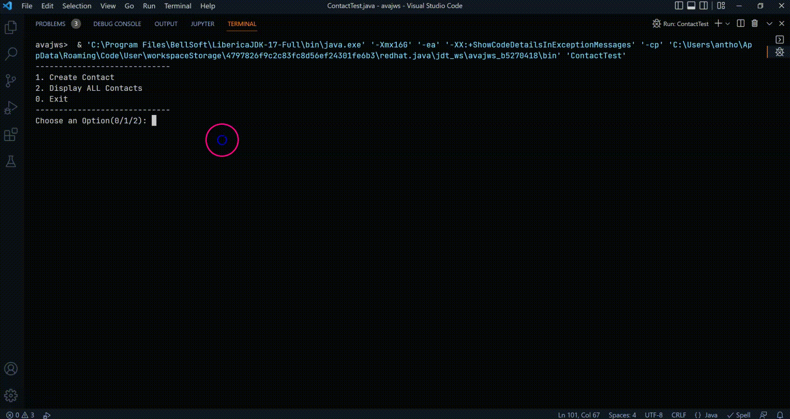

# Feature Phone Contact Manager
Create a Java Application for Simple Feature Phone Contact Manager. Assume that the phone contact  capacity is 3. You can create a Contact Class with name and mobile number as the properties. Also create required constructors, getter and setter methods, and toString method. There must be two options for user 1. Create Contact and 2. Display ALL Contacts.

## Constraints
- You should use Array Of Objects Concept for storing contacts
- Object should be created only when user select the "Create Contact" Option
(use static variable for storing Object Array Index in Test Class)
- If the Contact Object is reached maximum then display the message "Phone contact is full!"
- Validate the name and mobile number using static boolean methods (In Test Class) while creating contact
- Name should be minimum of three characters, name.matches([a-zA-Z]+) String method can be used
- Mobile number should be exactly 10 digits, mobile.matches([0-9]+) String method can be used
- Do not consider the NULL object(s) while displaying ALL contacts 

## Concepts Covered
- static variable and methods
- do while loop
- classes and objects
- data encapsulation
- array of objects
- Input and Output

## Rubrics
- Creating Contact class with ALL standards - 2 Marks
- Name and Mobile Number validation using static methods- 2 Marks
- Creating Contact Array of Object with validation  - 3 Marks
- Displaying ALL contacts by excluding NULL - 3 Marks

## Source Code
```java
import java.util.Scanner;

/**
 * BCSE103E - LAB Assessment-1 (10 Marks)
 * 
 * @author Anthoniraj Amalanathan
 * @since 20-Aug-2022
 */

class Contact {
    private String name;
    private String mobileNumber;

    public Contact() {
    }

    public Contact(String name, String mobileNumber) {
        this.name = name;
        this.mobileNumber = mobileNumber;
    }

    public String getName() {
        return name;
    }

    public void setName(String name) {
        this.name = name;
    }

    public String getMobileNumber() {
        return mobileNumber;
    }

    public void setMobileNumber(String mobileNumber) {
        this.mobileNumber = mobileNumber;
    }

    public String toString() {
        return "Contact [name=" + name + ", mobileNumber=" + mobileNumber + "]";
    }

}

public class ContactTest {
    private static int objectCount = 0;

    private static boolean isValidName(String name) {
        if (name.matches("[A-Za-z]+") && name.length() >= 3) {
            return true;
        }
        return false;
    }

    private static boolean isValidMobileNumber(String mobileNumber) {
        if (mobileNumber.matches("[0-9]+") && mobileNumber.length() == 10) {
            return true;
        }
        return false;
    }

    public static void main(String[] args) {
        Scanner sc = new Scanner(System.in);
        /* Initialize Phone Contact Capacity as 3 */
        Contact contact[] = new Contact[3];
        int flag;
        do {
            System.out.println("-----------------------------");
            System.out.println("1. Create Contact");
            System.out.println("2. Display ALL Contacts");
            System.out.println("0. Exit");
            System.out.println("-----------------------------");
            System.out.print("Choose an Option(0/1/2): ");
            flag = sc.nextInt();
            sc.nextLine();
            if (flag == 1) {
                if (objectCount < 3) {
                    System.out.print("Contact Name (Min 3 Chars): ");
                    String name = sc.nextLine();
                    System.out.print("Mobile Number (10 Digits): ");
                    String mobile = sc.nextLine();

                    if (isValidName(name) && isValidMobileNumber(mobile)) {
                        contact[objectCount] = new Contact(name, mobile);
                        // System.out.println(contact[objectCount].toString());
                        objectCount++;
                    } else {
                        System.out.println("Invalid Data! Choose the option again");
                    }

                } else {
                    System.out.println("Phone Contact Full!");
                }
            } else if (flag == 2) {
                for (int i = 0; i < contact.length; i++) {
                    if (contact[i] != null) // Skip the NULL Objects
                        System.out.println(contact[i].toString());
                }
            }

        } while (flag != 0);
    }
}
```
## Output


