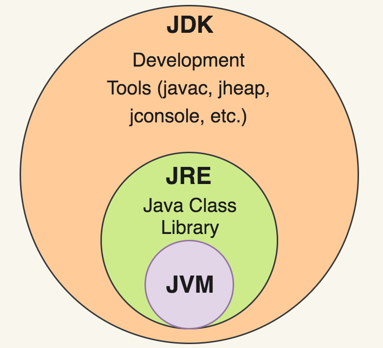

# Introduction to Java
## Course: Computer Programming: Java
- Computer
    - A machine or electronic device that can store and process information
    - Computer will understand only Binary System (0/1)
- Program 
    - Program is set of commands or instructions to the computer to do a task or job
- Java
    - Java is a general purpose, object oriented, functional programming language. 
    - Java has both Compiler(javac) and Interpreter (java)
        - Compiler: Scan ALL the statements at once and translate the code
        - Interpreter: Scan one statement at a time and translate it

## Simple Java Program
```java

/*
 * Demo "Hello World" Java Program
 * @author Anthoniraj Amalanathan
 * @since 25-Jul-2022
 */

public class App {
    public static void main(String[] args) {
        System.out.println("Hello World!");
    }
}
```
- To compile the Java Program
    - `javac App.java`
- To run the Java Program
    - `java App` (without .class or .java extension)
- To view the Bytecode
    - `javap -c App`

## JDK vs JRE vs JVM
- JDK - Java Development Kit (for javac, javap, jconsole, jheap)
- JRE - Java Runtime Environment ( for basic libraries)
- ByteCode - Intermediate Code for WORA (Write Once Run Anywhere)
- JVM - Java Virtual Machine (java - for translating Bytecode into Binary)



## Java Versions

## JDK Flavours

## Reference
- Java Bytecode Reference: https://javaalmanac.io/